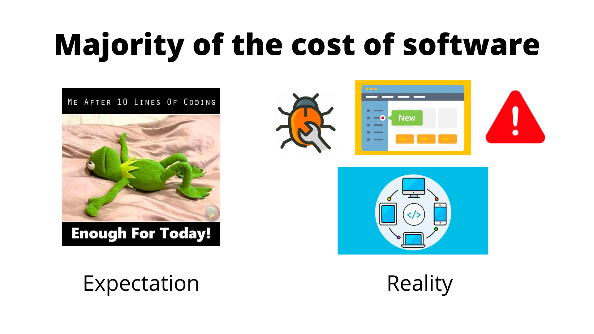
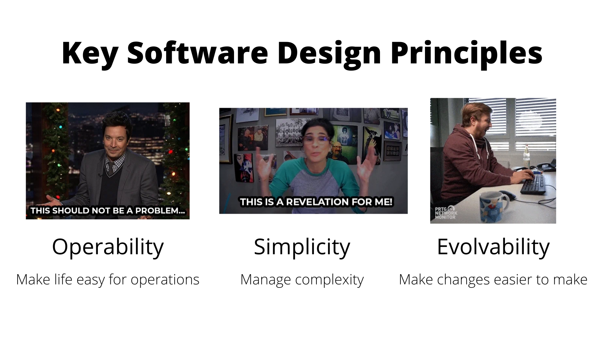
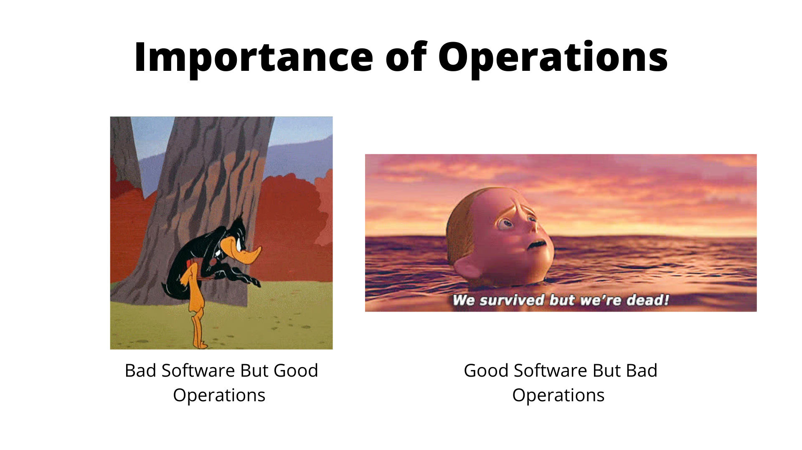
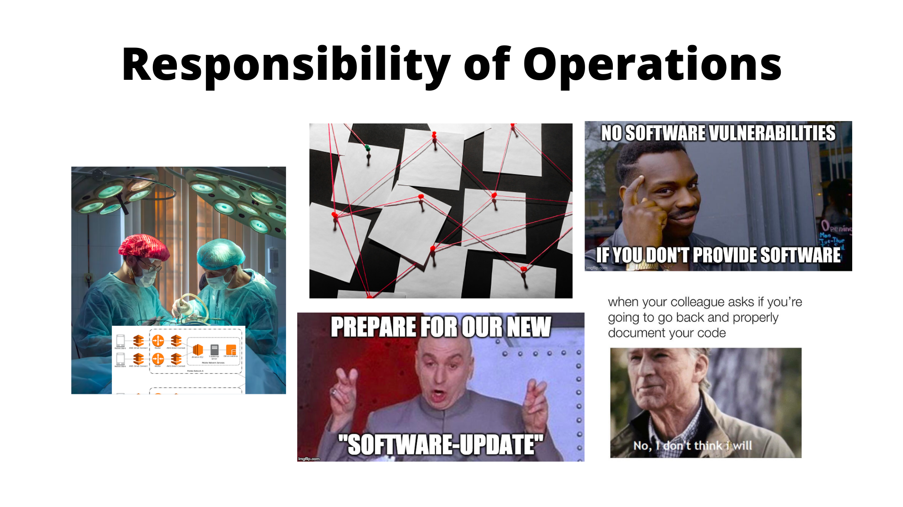
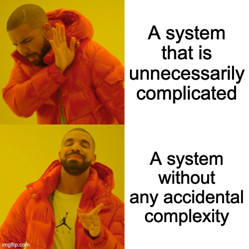

# Chapter 1: Reliable, Scalable and Maintainable Applications

The first part of the book focuses towards fundamentals of designing a data-intensive application. These fundamentals applies for a single-node as well as in a distributed setting.


The first chapter introduces the terminology and concepts of reliability, scalability and maintainability and how we can achieve these for our systems. The following is going to be covered:

- [Thinking About Data Systems](#thinking-about-data-systems)
- [Reliability](#reliability)
- [Scalability](#scalability)
- [Maintainability](#maintainability)


* Most applications these days are "data-intensive" rather than compute-intensive - CPU in not the bottleneck which means -
    * it needs to process large quantity of data
    * the complexity of data is high
    * time to process the data should be minimum

* An application needs to
    * store and retrieve data in some fashion (databases)
    * save and quickly retrieve result for an expensive operation (cache)
    * search for data (indexes)
    * send data from one context to another for processing async (stream)
    * process a bulk of data at once (batch)


* Why data systems?
    * Inspite of different characteristics of a database, cache, queue, etc., the tools are blurring the boundary of classification of these systems. For e.g. Apache Kafka is a queue which can provide database-like durability or Redis being a datastore can also be used as a message broker/queue.


# Scalability

```
💡 What is scalability?

It is a term used to describe a system's ability to handle increased load.
```

```
❌ X is scalable or Y doesn't scale
✅ How can we add computational resources to cope with additional load? 
✅ If at any given point of time, we might have 100,000 requests per minute, what are our options to ensure that
	 our systems don't crash?
```

## Describing load

## Describing Performance

## Approaches for Coping with Load


# Maintainability





## Operability: Making Life Easy for Operations



- Automating things is important but setting them up is still a manual process and should be done with care




## Simplicity: Managing Complexity




## Evolvability: Making Change Easy

